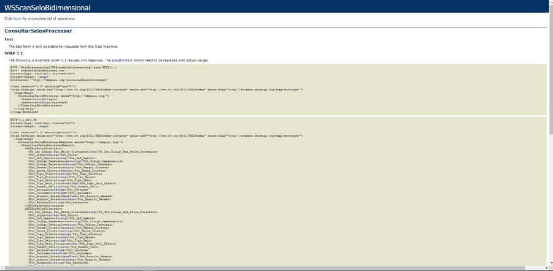
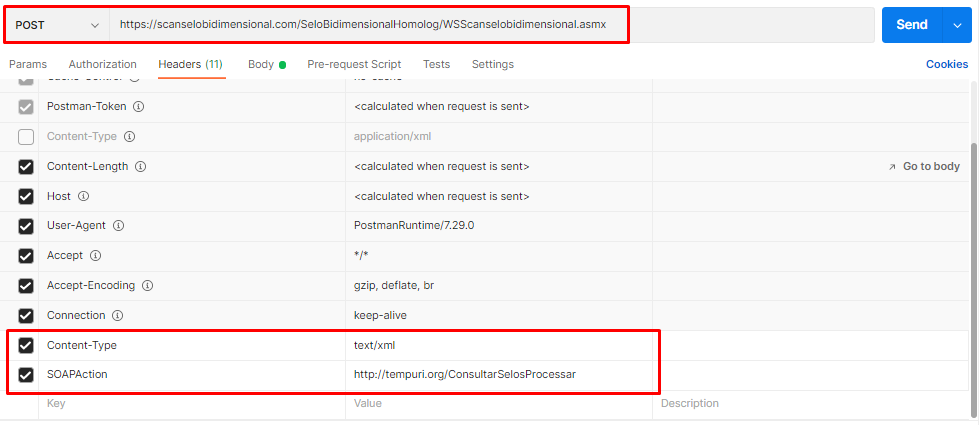
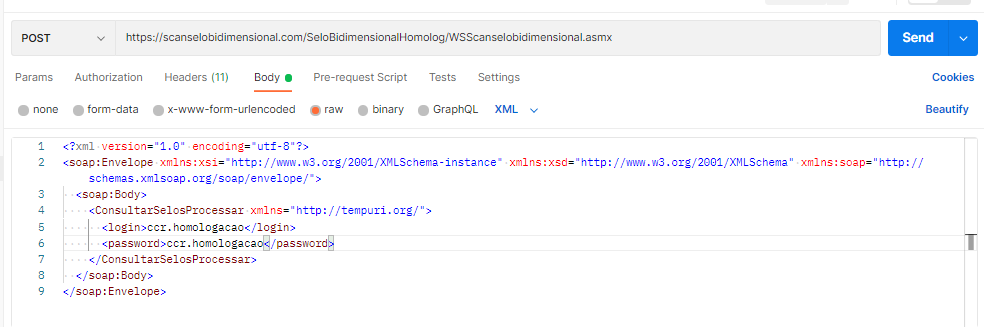

## CONSUMO DE SELOS POR APLICAÇÃO DE BILHETAGEM

Aplicações de bilhetagem podem consultar os selos processados pelo sistema Scan Selo Bidimensional, acessando o end point:

    https://scanselobidimensional.com/SeloBidimensional/WSScanselobidimensional.asmx?op=ConsultarSelosProcessar

## CONSULTAR SELOS NÃO PROCESSADOS (POSTMAN)

Para consultar os selos que ainda não foram processados, deve-se inserir a url do webservice como método "POST"

    https://scanselosbidimensional.com/seloBidimensional/WSScanselobidimensional.asmx

Inserir no Body da requisição as seguintes informações

