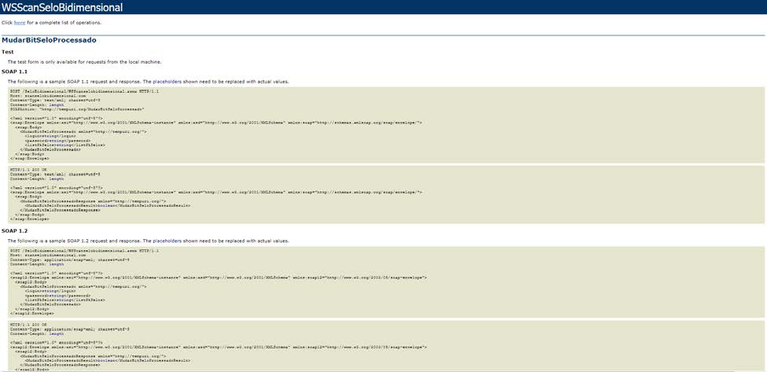

## FLUXO DE ATUALIZAÇÃO DE SELOS APÓS CONSUMO DE APLICAÇÃO DE BILHETAGEM

Após o consumo dos selos pela aplicação de bilhetagem é necessário informar o sistema Scan Selo Bidimensional quais selos foram consumidos, para que dessa forma seja atualizado a base de dados evitando assim o consumo novamente do mesmo selo.

Faz se necessário o envio do ID de cada selo para o end point:

    https://scanselobidimensional.com/SeloBidimensional/WSScanselobidimensional.asmx?op=MudarBitSeloProcessado

