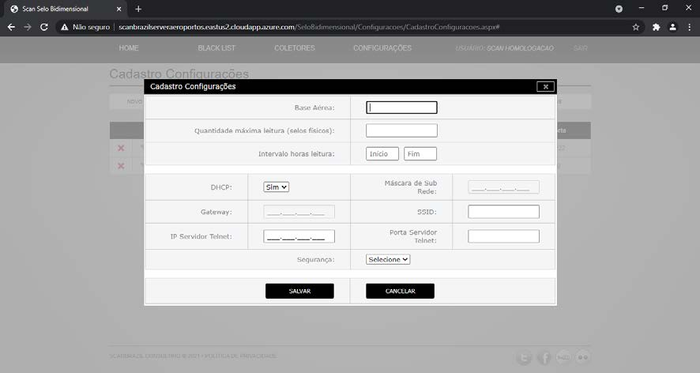

## AMBIENTE WEB

### Acessando ScanSeloBidimensional Web

Para acessar o sistema Scan Selo Bidimensional Web, acesse em seu nvagador de internet a url :

    https://scanselobidimensional.com/SeloBidimensional

Faça o LOGIN utilizando as credênciais fornecidas pelas Scan Brazil Consulting para o primeiro acesso.

No primeiro acesso ao sistema será solicidado a troca da senha padrão de acesso.

### Configuração da Base Aerea

Acesse o link “CONFIGURAÇÕES > CADASTRO DE CONFIGURAÇÕES” para cadastrar as configurações da rede Wi-Fi para cada aeroporto. Na página de configurações, clique no botão “NOVO CADASTRO”:

Preencha todos os dados com as configurações da base aerea e rede Wi-Fi que os coletores irão acessar para enviar os selos no modo on-line e clique no botão “SALVAR”:

### Configuração dos Coletores

Acesse o link “COLETORES” > “CADASTRO COLETORES” para cadastrar as configurações de cada coletor. Na página dos coletores, clique no botão “NOVO CADASTRO”:

Preencha todos os dados com as configurações do coletor que esta sendo atualizado e clique no botão “SALVAR”:

### Cadastro de Senha Administrativa

Acesse o link “COLETORES” > “SENHA ADMINISTRATIVA” para cadastrar a senha administrativa dos coletor. Na página da senha administrativa, clique no botão “CADASTRAR NOVA SENHA”:

Para segurança das informações e configurações é necessário que seja cadastrado uma senha administrativa para acesso as configurações dos coletores. Esse senha será solicitada para qualquer configuração a ser realizada de forma manual no coletor.