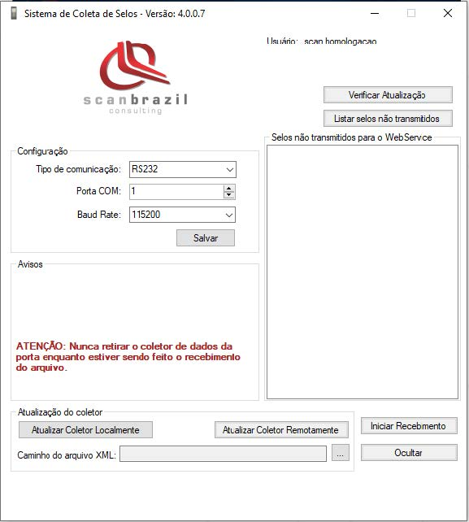

## INSTALAÇÃO APLICAÇÃO DE PROCESSAMENTO DOS SELOS

### Backup selos não processados

Antes de qualquer instalação será necessário fazer um backup da pasta onde estão os selos coletados que ainda não foram processados e enviados para o servidor.

Navegue até a pasta onde está instalado o programa “ScanSeloBidimensionalClient.exe”, essa pasta por padrão está localizada no endereço 

    “C:\ScanSeloBidimensionalServer”.

Localize a pasta “Selos”, clique com o botão direito sobre a pasta para abrir o menu suspenso de opções, em seguida selecione a opção “Copiar”.

Navegue até uma pasta de sua preferência, clique com o botão direito na tela e escolha a opção “Colar”

### Desistalar aplicação desatualizada

Após o backup da pasta de selos não processados, será necessário desinstalar a aplicação antiga para que não tenha nenhum interferência no funcionamento da nova aplicação Scan Selo Bidimensional.

Acesse o “Painel de Controle”, utilize as teclas “Windows + R” para abrir a caixa de comandos e digete “control panel” e tecle ENTER

No painel de controle encontre a opção “Desinstalar um programa”, em seguida encontre a aplicação ScanSeloBidimensionalClientSetup, selecione a aplicação e clique em “Desinstalar”.

### Instalação aplicação ScanSeloBidimensional Client

Execute o programa de instalação “ScanSeloBidimensionalClientSetup.msi” que encontra-se junto aos arquivos do pacote de instalação.

Clique em Avançar para iniciar a instalação.

Verifique se o endereço de instalação está correto e clique novamente em Avançar.

Clique novamente em Avançar para iniciar a instalção.

Se não houver nenhum erro durante a instalção será criado um atalho na área de trabalho.

A aplicação está pronta para ser executada. Será necessário entrar com Usuário e Senha fornecidos para ter acesso aos funções da aplicação.

Após entrar com um Usuário válido será possível aproveitar todas as atualizações da aplicação ScanSeloBidimencional.

)